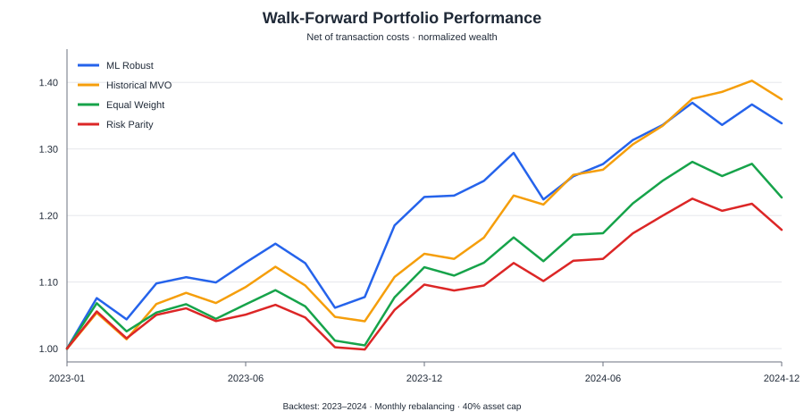

# Portfolio Optimization Under Uncertainty Using Machine Learning

A recruiter-facing portfolio project exploring whether machine-learning forecasts can improve multi-asset portfolio allocation when expected returns are uncertain.

The project compares an **uncertainty-aware Random Forest allocation strategy** with three transparent baselines: historical mean-variance optimization, equal weighting, and risk parity. The analysis uses five liquid ETFs spanning U.S. equities, international equities, bonds, gold, and real estate.

> **Key result:** after correcting the original coursework backtest to remove look-ahead bias and align the forecast horizon with monthly rebalancing, the ML strategy was competitive but did **not** outperform historical mean-variance optimization over 2023–2024. This is an important model-risk finding: apparent ML gains can disappear when the evaluation design becomes stricter.

## Results

Walk-forward backtest, January 2023 through December 2024, with a 40% asset cap and 10 bps transaction cost per unit of turnover.

| Strategy | Total return | Ann. return | Ann. volatility | Sharpe (rf=0) | Sortino | Max drawdown |
|---|---:|---:|---:|---:|---:|---:|
| **Historical MVO** | **37.47%** | **17.32%** | 9.83% | **1.76** | **2.57** | -8.48% |
| **ML Robust** | 33.85% | 15.76% | 10.32% | 1.53 | 2.28 | -10.01% |
| Equal Weight | 22.70% | 10.82% | 9.46% | 1.14 | 1.71 | -9.28% |
| Risk Parity | 17.84% | 8.59% | **7.90%** | 1.09 | 1.60 | **-8.26%** |



## What the ML model does

At each monthly rebalance date, the model only uses information available at that time.

For every ETF:

1. A Random Forest predicts the **next 21 trading-day cumulative log return**.
2. Features include the five most recent daily returns, 21-day momentum, and 21-day realized volatility.
3. The dispersion of predictions across individual trees is used as a **model-uncertainty proxy**.
4. The optimizer uses a conservative forecast:

   `robust expected return = RF mean forecast - λ × tree-prediction dispersion`

5. Portfolio weights maximize expected return per unit of covariance risk, subject to long-only weights, full investment, and a 40% maximum allocation per ETF.

The tree dispersion is deliberately described as an uncertainty *proxy*, not a calibrated confidence interval.

## Why the backtest was redesigned

The original assignment averaged predictions across the full 2023–2024 test sample and then optimized one fixed portfolio using that average. Although the model itself was trained on pre-2023 observations, using the full test-period prediction average to choose weights leaks information from later test dates into the portfolio decision.

This repository uses a stricter walk-forward design instead:

- rebalance monthly;
- train only on data available before the rebalance date;
- ensure forward-return labels are fully observable before model fitting;
- forecast a monthly horizon that matches the holding period;
- estimate covariance using the same trailing information set;
- apply identical 40% concentration constraints to optimized strategies;
- report results after transaction costs.

This makes the comparison closer to how the strategy could have been implemented in real time.

## Assets

| ETF | Exposure |
|---|---|
| SPY | U.S. equities |
| EFA | Developed-market equities ex-U.S./Canada |
| AGG | U.S. investment-grade bonds |
| GLD | Gold |
| VNQ | U.S. real estate |

Daily OHLCV data were obtained from Stooq. The research sample is restricted to 2018–2024; 2023–2024 is reserved for the walk-forward evaluation.

## Average portfolio weights

| ETF | ML Robust | Historical MVO | Equal Weight | Risk Parity |
|---|---:|---:|---:|---:|
| SPY | 35.8% | 40.0% | 20.0% | 13.2% |
| EFA | 13.3% | 16.8% | 20.0% | 13.5% |
| AGG | 16.4% | 6.1% | 20.0% | 40.0% |
| GLD | 21.9% | 36.5% | 20.0% | 22.0% |
| VNQ | 12.5% | 0.5% | 20.0% | 11.3% |

The ML strategy remained diversified, while historical MVO frequently pushed against the 40% cap in SPY and allocated heavily to GLD. Risk parity, as expected, allocated much more heavily to AGG because of its lower volatility.

## Repository structure

```text
ml-portfolio-optimization/
├── data/                         # Prepared Stooq ETF prices
├── figures/                      # Recruiter-ready output chart
├── notebooks/
│   └── portfolio_optimization.ipynb
├── results/                      # Key backtest outputs
├── src/ml_portfolio/
│   ├── __init__.py
│   └── backtest.py               # Reusable data, ML, optimization & metrics code
├── tests/
│   └── test_backtest.py
├── run_analysis.py               # Reproduce all results and figures
├── requirements.txt
└── README.md
```

## Reproduce the analysis

```bash
python -m venv .venv
# Windows: .venv\Scripts\activate
# macOS/Linux: source .venv/bin/activate
pip install -r requirements.txt
python run_analysis.py
```

The script regenerates the tables in `results/` and all figures in `figures/`.

## Main design choices

- **Walk-forward evaluation:** avoids using future test observations in current allocation decisions.
- **21-day prediction target:** aligns expected-return forecasting with monthly rebalancing.
- **Three-year rolling window:** keeps model and covariance estimates responsive to changing regimes while retaining enough training data.
- **Random Forest:** captures nonlinear relationships without requiring a parametric return model.
- **Uncertainty penalty:** discourages allocations based on high-dispersion forecasts.
- **40% position cap:** reduces concentration risk from noisy expected-return estimates.
- **10 bps turnover cost:** prevents cost-free rebalancing assumptions.
- **Multiple baselines:** avoids judging ML only against a weak benchmark.

## Limitations

This is an academic portfolio study, not a production trading system. Important limitations include the small asset universe, a short two-year evaluation window, no explicit risk-free rate, no tax/slippage model beyond simple turnover costs, and no hyperparameter tuning nested inside the walk-forward loop. Random-Forest tree dispersion is also not a statistically calibrated forecast interval.

A natural next step would be nested time-series validation for the uncertainty penalty and model hyperparameters, followed by a longer multi-regime evaluation and probabilistic return forecasting.

## Skills demonstrated

`Python` · `pandas` · `NumPy` · `scikit-learn` · `SciPy` · `Random Forests` · `mean-variance optimization` · `risk parity` · `walk-forward backtesting` · `model risk` · `financial time series`

## Background

This project originated as an individual Data Science for Engineers assignment. The GitHub version was subsequently refactored into a reproducible research project and the evaluation methodology was tightened to address look-ahead bias and forecast-horizon mismatch found during review.
